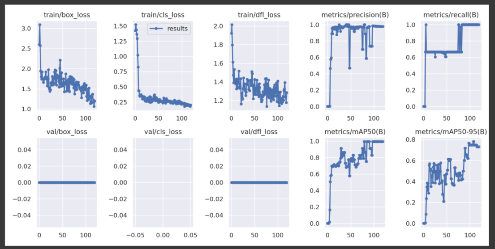

Number plate detection using YOLOv8 involves training a deep learning model to accurately identify and localize license plates in both images and video frames. This process includes collecting and annotating a diverse dataset of vehicle images, training the YOLOv8 model to recognize number plates, and applying the model to detect plates in images and video footage. This method is used in applications such as automated toll systems, parking management, and traffic monitoring, offering precise and efficient vehicle identification.
##Performance Evaulation

